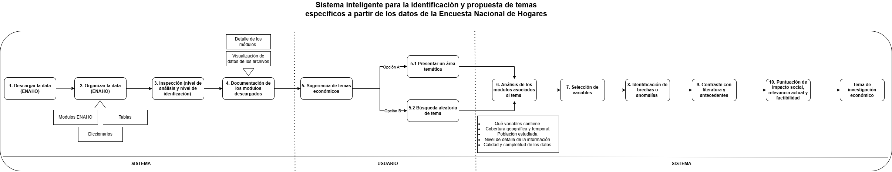

# Sistema Inteligente ENAHO

De los **microdatos de la Encuesta Nacional de Hogares (ENAHO)** del INEI a un **tema de investigación económico** concreto, viable y puntuado — todo desde una TUI (interfaz de terminal).



El sistema descarga y organiza la data, la documenta, y luego usa razonamiento (con tu suscripción de Claude, vía Claude Code en modo headless) para **proponer temas de investigación causales, seleccionar variables, medir brechas reales con polars, contrastar con literatura web y puntuar** la propuesta. Soporta **selección de uno o varios años** a la vez, verificando que las variables elegidas existan en todos los años de cobertura, y **prioriza diseños de causalidad fuerte** sobre débil o simple asociación al proponer temas. Si tenés varias carpetas de datos descargadas, elegís con cuál trabajar antes de empezar.

---

## El pipeline (10 pasos, 3 carriles)

```
① SISTEMA · Preparación        ② USUARIO · Exploración        ③ SISTEMA · Evaluación
1 Descargar data               5 Sugerir temas                8 Brechas / anomalías (pandas)
2 Organizar                    6 Analizar módulos             9 Literatura (web)
3 Inspección                   7 Selección de variables       10 Puntuación
4 Documentación (PDF + HTML)                                  → 📋 Ficha de investigación
```

- **Pasos 1–4 (deterministas):** descarga (corte transversal, CSV), organización en `modulos/` + `tablas_descripcion/`, inspección (unidad de análisis y **llave de identificación verificada**), y documentación (PDF + visor HTML interactivo con diccionario de variables **y sus códigos de valor**, ej. qué número corresponde a cada categoría).
- **Pasos 5–10 (razonamiento):** corren con tu **suscripción de Claude** (`claude -p` headless, sin API key), siempre **anclados al catálogo real de datos** (grounding) para no inventar módulos, variables ni códigos de valor que no existan, ni usar variables que no existan en todos los años elegidos. El paso 5 **prioriza causalidad fuerte**: evalúa si hay un instrumento o corte de elegibilidad plausible antes de proponer, clasifica cada tema (`causal_fuerte` / `causal_debil` / `asociación`) y los ordena así — de forma determinista, no confía en que la IA los devuelva ya ordenados. Entre selección de variables y cálculo se agrega un **diseño causal** que vuelve a evaluar en serio y **avisa si el nivel prometido se degrada** al elegir las variables concretas. El **plan de merge** explica el nivel de análisis y verifica cada unión (evita joins que inflarían filas); si un archivo resulta ser a nivel ítem (varias filas por hogar), decide cómo reducirlo (agregar, restringir por un código real, o excluir si no hay forma segura). Los **filtros de población** usan códigos de valor verificados contra el diccionario oficial (nunca inventados) y se revisan entre sí para detectar combinaciones imposibles por el patrón de salto del cuestionario. El paso 8 **calcula brechas reales** con polars en streaming (ponderadas, limpiando centinelas de no-respuesta y comas decimales), año por año si hay varios; el paso 9 usa **búsqueda web** con fuentes verificables. Cada modelo (`sonnet`/`haiku`) se asigna según qué tan crítico es el paso, para cuidar tu cuota.

El entregable final es una **ficha** (en pantalla y en PDF, `salidas/fichas/`) con: tema, cobertura de años, diseño causal, variables (código + significado del diccionario), **plan de merge y filtros verificados**, brechas medidas —con su evolución si hay varios años— y puntuación (impacto / relevancia / factibilidad). El progreso se guarda en cada paso (`temas/<tema>/propuesta.json`), así una interrupción a mitad de camino no pierde el trabajo ni la cuota gastada.

Un paso adicional (**11 · Exportar dataset final**) ejecuta de verdad el plan de merge y filtros —no solo lo describe— y entrega un CSV mergeado y limpio junto a su control de calidad (duplicados por llave, nulos, qué se agregó/restringió/excluyó). El detalle completo de esa metodología (selección de variables, filtros, limpieza, resolución de niveles) está en [docs/metodologia_datos.md](docs/metodologia_datos.md).

---

## Requisitos

- Python 3.9+
- [Claude Code](https://claude.com/claude-code) instalado y con sesión iniciada (los pasos 5–10 usan `claude -p` con tu suscripción)
- Dependencias Python:

```bash
pip install -r requirements.txt
```

---

## Uso

```bash
python sistema_enaho.py
```

Se abre la TUI (full-screen). Navega con teclado o mouse:

- **f** Carpeta de datos — si hay más de una carpeta `enaho_*` descargada, elegís con cuál trabajar (ve años y estado de cada una), mezclar todas, o ir directo a descargar una nueva. Se abre sola al iniciar si detecta varias.
- **1** Descargar (te pide año(s): `2024`, `2015-2020`, `2018 2019`)
- **2** Organizar · **3·4** Documentar (genera PDF, visor HTML y catálogo)
- **5 ▶ Proponer tema** — el flujo estrella: elige **uno o varios años** con el catálogo disponible, un área temática (o deja que el sistema proponga 3 al azar) y corre 5→10 hasta la ficha. Los temas se muestran ordenados por solidez causal (🟢 fuerte / 🟡 débil / ⚪ asociación); si querés evitar un tema puntual (ej. uno ya investigado), decilo en el campo de contexto y la IA explora otras alternativas.
- **v** Ver propuestas guardadas (marca `[✓]` completa o `[⚠ incompleta]` si una corrida se cortó a mitad de camino) · **c** Regenerar catálogo · **q** Salir

Las salidas (documentación PDF, visor HTML y fichas de investigación) se escriben en `salidas/<año>/` y `salidas/fichas/`.

---

## Estructura

```
sistema_enaho.py            # TUI principal (Textual)
scripts/
  descargar.py              # paso 1 (PyPeruStats, CSV, corte transversal)
  ordenar.py                # paso 2 (modulos/ + tablas_descripcion/)
  generar_documentacion_pdf.py   # paso 3–4 (PDF)
  generar_visor_html.py     # paso 4 (visor HTML + inspección streaming)
  catalogo.py               # catálogo de grounding (JSON, por año, incluye códigos de valor del diccionario)
  razonador.py              # pasos 5–10 vía claude -p (multi-año, prioridad causal, resolución de niveles)
  estadistica.py            # brechas, verificación de merge/filtros, dataset final (paso 11)
  ficha_pdf.py              # genera la ficha de investigación en PDF
.claude/agents/             # agentes de apoyo (descarga, ordenar, documentar, visor, revisión)
.claude/hooks/check_py.py   # verifica sintaxis + smoke test tras cada edición (ver Desarrollo)
```

Los microdatos (`enaho_*/`) y las salidas generadas (`salidas/`, `temas/`) **no se versionan** (ver `.gitignore`): son pesados y re-generables.

---

## Notas de diseño

- **Grounding total:** el razonamiento se ancla al catálogo real; no propone módulos, variables, años ni **códigos de valor** que la data no soporte (se verifica que cada variable exista en todos los años de cobertura, no solo en el catálogo del año representativo; los filtros y restricciones categóricas usan el código numérico real del diccionario oficial, o quedan `null` en vez de adivinarlo).
- **Prioridad causal, no solo descriptiva:** el paso 5 evalúa la solidez de identificación (instrumento/discontinuidad plausible) ANTES de proponer un tema, y un paso posterior de diseño causal vuelve a evaluarlo con las variables ya elegidas — si se degrada, avisa explícitamente en vez de quedarse con la etiqueta optimista inicial.
- **Memoria acotada:** toda inspección y cálculo (documentación, brechas, verificación de merge, dataset final) corre en *streaming* con polars, así procesa archivos de varios GB (ej. el módulo de gastos, ~9M filas) sin cargarlos enteros en RAM.
- **Honestidad:** títulos desde el diccionario oficial del INEI; llaves verificadas contra los datos; literatura con URLs reales; el diseño causal admite cuando solo hay asociación, no causalidad fuerte; una brecha que no se puede calcular explica por qué (categorías con pocos casos, sin overlap, etc.) en vez de mostrar un valor mudo; un archivo a nivel ítem que no se puede reducir con seguridad queda excluido del dataset final, no adivinado.
- **Detección, no adivinanza:** los filtros de población se revisan entre sí antes de usarlos — si dos combinados dan 0 filas pero cada uno por separado sí tiene datos, es la firma de una contradicción por el patrón de salto del cuestionario ENAHO, y el sistema lo señala en vez de entregar un resultado vacío sin explicación (detalle completo en [docs/metodologia_datos.md](docs/metodologia_datos.md)).
- **Robustez de datos reales:** el motor detecta y corrige quirks entre años de la ENAHO (delimitador `,`/`;`, decimal `.`/`,`, factores de expansión con nombre distinto por módulo) — encontrados verificando contra datos reales, no asumidos.
- **Múltiples fuentes de datos:** si hay varias carpetas `enaho_*` (distintos años/rangos descargados en momentos distintos), elegís explícitamente con cuál trabajar; esa elección se propaga hasta el cálculo real, no solo hasta el catálogo, para no mezclar sin querer datos de carpetas distintas.
- **Nada se pierde:** el progreso de una propuesta se guarda tras cada paso; si la cuota se agota o algo falla a mitad de camino, queda marcado `incompleta` con el error exacto, no se descarta.
- **Costo de cuota:** cada paso de razonamiento usa el modelo (`sonnet`/`haiku`) que corresponde a su complejidad, no el más caro por defecto.

## Desarrollo

Un hook local (`.claude/hooks/check_py.py`, vía `.claude/settings.json`) corre tras cada edición de un `.py` del sistema: verifica sintaxis y hace un smoke test del TUI, sin usar la suscripción de Claude. Si algo se rompe, bloquea con el motivo exacto en vez de dejarlo pasar.
